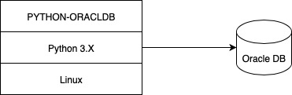

# Python 3.X

## Python - Oracle DB - Thin Mode

Python scripts to Oracle DB will work in Thin mode as seen in the diagram above.  But later versions now of Python will fail when selecting dates, timestamps where the fields have named timezones.  For example "select * from table1" won't work, you'll need to "select field1, to_char(field2,date_format)" for it to work.

 

## Python - Oracle DB - Thick Mode - 1

Python scripts to Oracle DB will work in Thick mode as seen in the diagram above.  But later versions now of Python will fail when selecting dates, timestamps where the fields have named timezones.  For example "select * from table1" won't work, you'll need to "select field1, to_char(field2,date_format)" for it to work.  This is because the timezone on the database and OS or where Python is may not match.

 

## Python - Oracle DB - Thick Mode - 2

Python scripts to Oracle DB in Thick mode and the matching timezone file is used, as seen in the diagram above.  For example "select * from table1" will work without accomidating date / timestamp fields.
